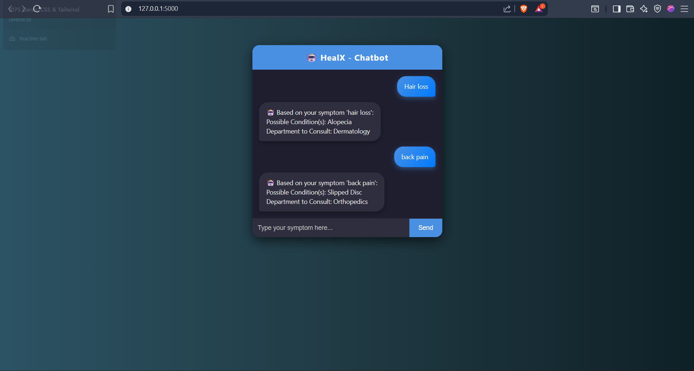

🤖 HealX – HealX Assistant Chatbot

A simple AI-powered health assistant chatbot built using Flask, AIML, and Python.
It allows users to enter symptoms and get:

✅ Possible medical conditions

✅ Suggested health department to consult

⚠️ Disclaimer that this is not medical advice

🚀 Features

User-friendly chat interface (modern UI with chat bubbles).

Symptom lookup from CSV dataset.

Fuzzy matching for misspelled symptoms.

AIML fallback responses when symptom is not found.

Department recommendations (e.g., Cardiology, Pulmonology, Dermatology).

Flask backend with REST API (/chat).

📂 Project Structure
.
├── app.py               # Flask backend
├── data.csv             # Symptoms → Conditions dataset
├── symptoms.aiml        # AIML rules for fallback
├── templates/
│   └── index.html       # Frontend UI
├── static/
│   ├── style.css        # Chatbox styling
│   └── script.js        # (optional) JS logic
└── README.md            # Project docs

⚡ Installation & Setup
1️⃣ Clone the repo
git clone https://github.com/Ayush16r/team-264/tree/main/ChatBotN-main
cd healx-chatbot

2️⃣ Create virtual environment (recommended)
python -m venv venv
source venv/bin/activate   # On Mac/Linux
venv\Scripts\activate      # On Windows

3️⃣ Install dependencies
pip install flask pandas python-aiml

4️⃣ Run the app
python app.py

Then open: 👉 http://127.0.0.1:5000/ in your browser.

💻 Usage Example

User: cough
Bot:

🤖 Based on your symptom 'cough':  
Possible Condition(s): Respiratory Infection, Bronchitis  
Department to Consult: Pulmonology

🤝 Contributing

Pull requests are welcome! If you’d like to add more symptoms, improve UI, or enhance AI logic, feel free to fork and submit changes.