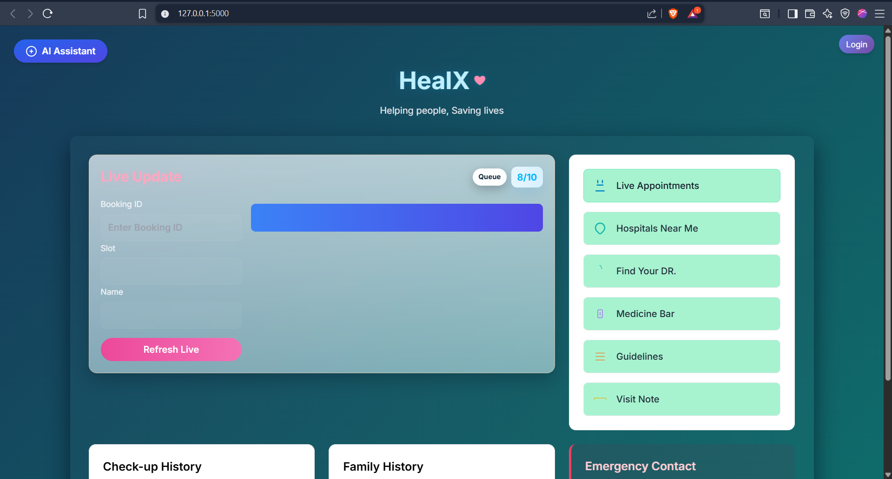
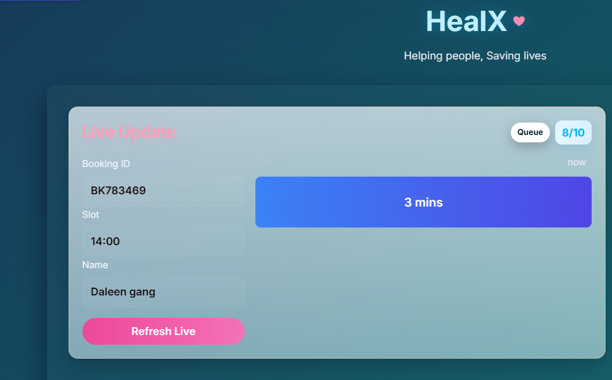

HealX – Patient Dashboard (Live Updates)

HealX is a healthcare web application designed to reduce patient waiting time and improve appointment management through real-time live updates, queue monitoring, and AI assistance.

🚀 Features

📊 Live Updates – Patients can check their queue position and estimated waiting time.

🧾 Booking Search – Enter Booking ID to fetch appointment details instantly.

⏳ Estimated Wait Time – Calculates based on department and patients ahead in queue.

🏥 Hospitals Near Me – Quick access to nearby hospitals.

💊 Medicine Box – Store and view prescribed medicines.

🎯 Feedback & Rewards – Collect patient feedback and reward engagement.

🤖 AI Assistant – Integrated chatbot assistant (via external link).

📱 Responsive UI – Built with Tailwind CSS and custom styles.

🛠 Tech Stack

Frontend: HTML, Tailwind CSS, JavaScript

Backend: Flask (Python)

Database: MongoDB Atlas (Cloud)

Styling: TailwindCSS + Custom CSS

Hosting: Compatible with Flask hosting services (Render, Heroku, etc.)

📂 Project Structure
HealX/
│
├── static/
│   ├── style.css        # Custom styles
│   ├── trail.js         # Live booking fetch logic
│
├── templates/
│   ├── index.html       # Main dashboard
│   ├── live_appointments.html
│   ├── hospitals_near_me.html
│   ├── med_box.html
│   ├── feedback_reward.html
│
├── user.py              # Flask app & API routes
├── README.md            # Project documentation

⚙️ Setup & Installation

Clone the repository

git clone https://github.com/your-username/healx.git
cd healx

Create a virtual environment

python -m venv venv
source venv/bin/activate   # Mac/Linux
venv\Scripts\activate      # Windows

Install dependencies

pip install flask pymongo

Add MongoDB connection
In user.py, update the MongoDB URI with your own:

MONGO_URI = "your-mongo-uri-here"

Run the Flask app

python user.py

App will run at: http://127.0.0.1:5000/

📊 Database Schema (MongoDB – bookings Collection)

Each booking document looks like:

{
  "booking_id": "B12345",
  "patient_name": "John Doe",
  "department": "General Medicine",
  "appointment_time": "2025-09-15T10:30:00",
  "status": "pending",   // or "completed"
  "created_at": ISODate("2025-09-13T09:00:00")
}

🔮 Future Improvements

✅ Admin dashboard for managing bookings

✅ Notifications (SMS/Email reminders)

✅ Better AI integration with patient medical history

