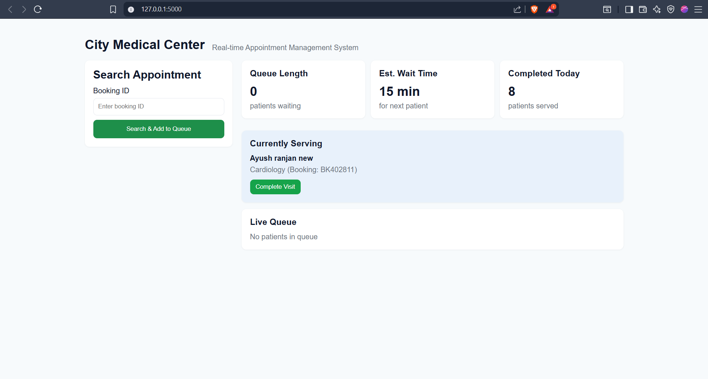

City Medical Center – Real-time Appointment Management System

A real-time hospital appointment and queue management system built with Flask, MongoDB, and Server-Sent Events (SSE).
It allows hospital staff to:

📋 Search and add patients to the live queue

⏳ Monitor queue length & estimated wait times

👩‍⚕️ Track currently serving patients

✅ Mark visits as complete and auto-assign next patient

📡 Live updates without page reloads

🚀 Features

Search by Booking ID to add patient into the queue

Real-time dashboard with Server-Sent Events (SSE)

Queue statistics: length, estimated wait, patients served today

Department-wise service times (e.g., Cardiology 15 mins, General 10 mins)

Current patient view with "Complete Visit" button

Auto-assign next patient when one is completed

MongoDB integration for persistence

📂 Project Structure
.
├── app.py                # Flask backend
├── templates/
│   └── index.html        # Dashboard UI
├── static/
│   ├── style.css         # Styling
│   └── main.js           # Frontend logic (SSE + fetch APIs)
└── README.md             # Documentation

⚡ Installation & Setup
1️⃣ Clone the repo
git clone https://github.com/Ayush16r/team-264/tree/main/ChatBotN-main
cd hospital-queue-system

2️⃣ Create virtual environment
python -m venv venv
source venv/bin/activate   # Mac/Linux
venv\Scripts\activate      # Windows

3️⃣ Install dependencies
pip install flask pymongo

4️⃣ Set up MongoDB

Use a local MongoDB or Atlas cloud database.

Create a DB and collection (default: mydb.appointments).

Update your MongoDB URI in app.py if needed:

MONGODB_URI = "your-mongodb-uri"
DB_NAME = "mydb"
COLL = "appointments"

5️⃣ Run the app
python app.py

Visit 👉 http://127.0.0.1:5000/

💻 Usage Example

Search for a Booking ID → patient is added to queue.

The system auto-assigns the first patient as Currently Serving.

Staff clicks Complete Visit → patient is marked completed, next one auto-starts.

Queue stats update instantly (via SSE).

